### 1.Linux Shell

#### 1.1 Shell变量

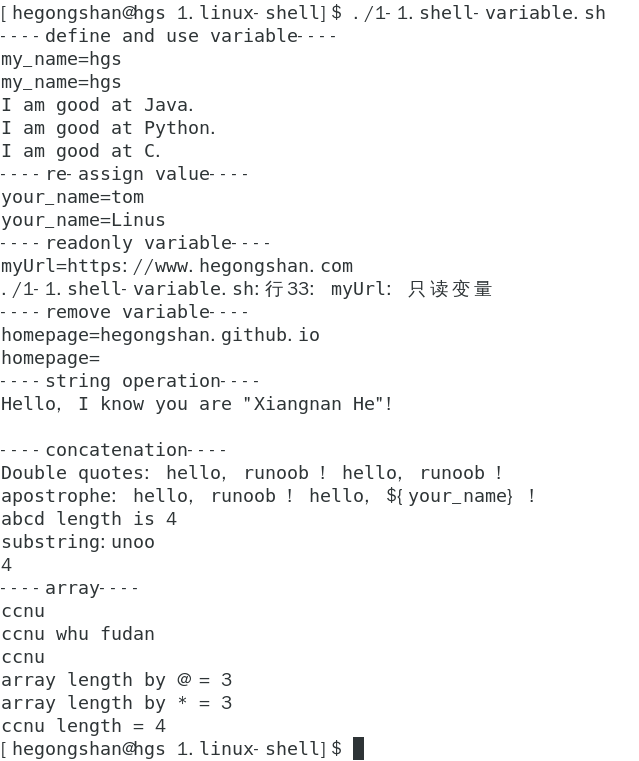

#### 1.2 传递参数

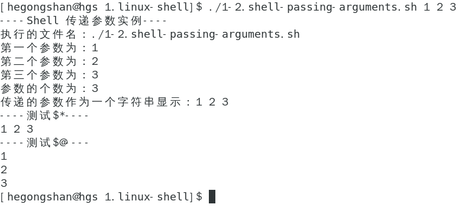

#### 1.3 数组

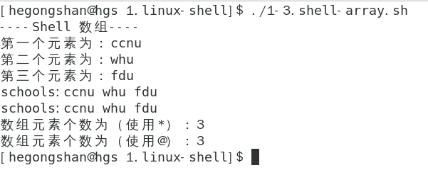

#### 1.4 运算符

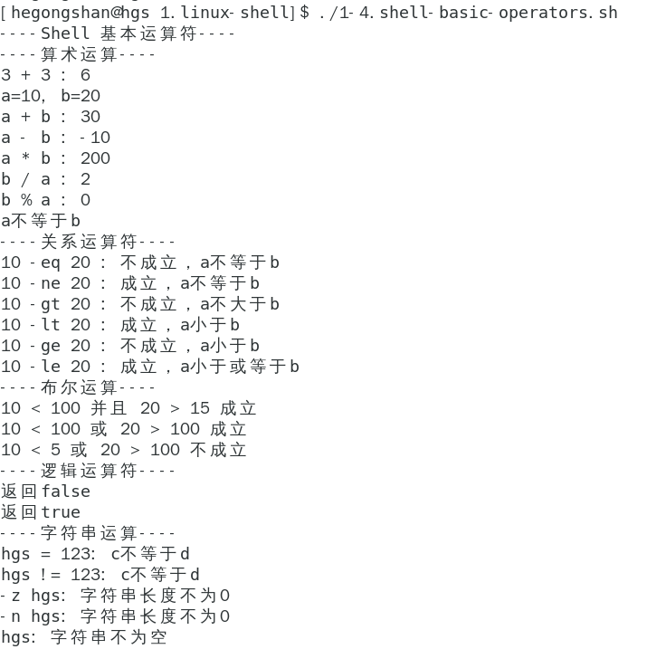

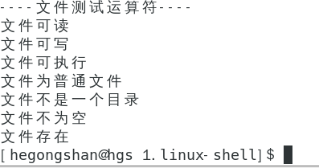

#### 1.5 echo命令

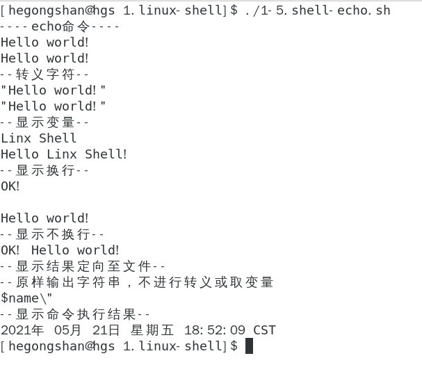

#### 1.6 printf命令

#### 1.7 test命令

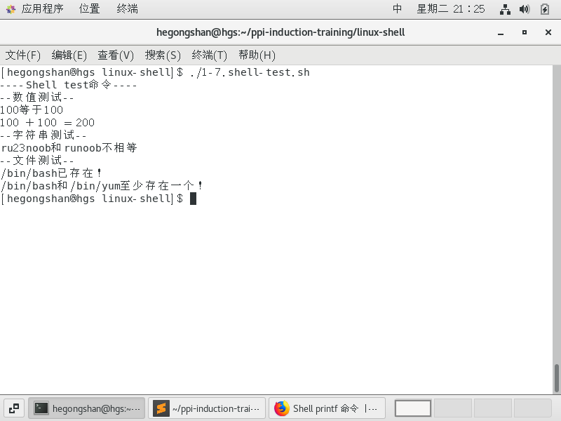

#### 1.8 流程控制

#### 1.9 函数

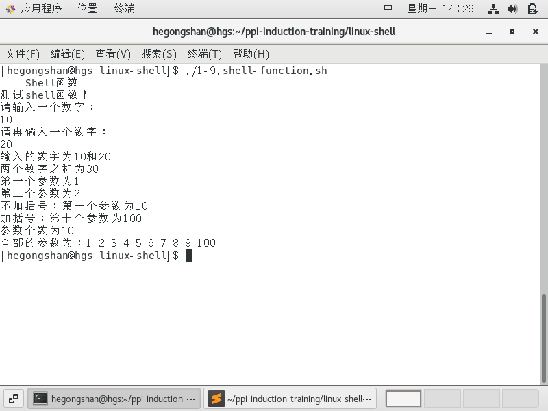

#### 1.10 重定向

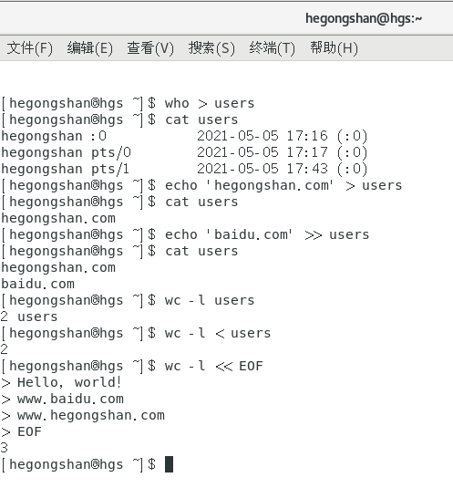

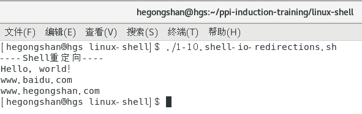

#### 1.11 文件包含

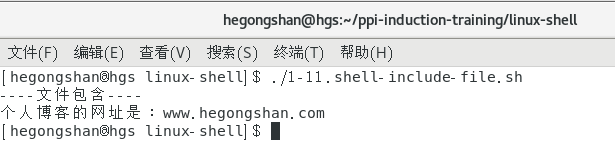
