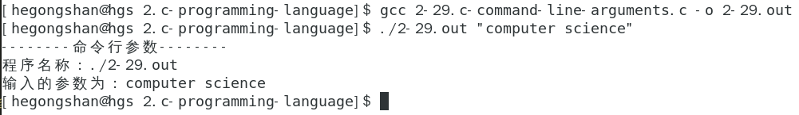

### C语言

#### 2.1 C程序结构

#### 2.2 数据类型

#### 2.3 C变量

#### 2.4 C常量

#### 2.5 存储类

#### 2.6 运算符

#### 2.7 判断

#### 2.8 循环

#### 2.9 函数

#### 2.10 作用域规则

#### 2.11 数组

#### 2.12 枚举

#### 2.13 指针

#### 2.14 函数指针与回调函数

#### 2.15 字符串

[字符串实验代码](./2-15.c-string.c)

#### 2.16 结构体

[结构体实验代码](./2-16.c-structures.c)

#### 2.17 共用体

[共用体实验代码](./2-17.c-union.c)

#### 2.18 位域

[位域实验代码](./2-18.c-bit-fields.c)

#### 2.19 typedef

[typedef关键字实验代码](./2-19.c-typedef.c)

#### 2.20 输入&输出

[io实验代码](./2-20.c-input-output.c)

#### 2.21 文件读写

[文件读写实验代码](./2-21.c-file-io.c)

#### 2.22 预处理器

[预处理器实验代码](./2-22.c-preprocessors.c)

#### 2.24 强制类型转换

[源文件](./2-24.c-type-casting.c)

#### 2.25 错误处理

[源文件](./2-25.c-error-handling.c)

#### 2.26 递归

[源文件](./2-26.c-recursion.c)

#### 2.27 可变参数

[源文件](./2-27.c-variable-arguments.c)

#### 2.28 内存管理

[源文件](./2-28.c-memory-management.c)

#### 2.29 命令行参数

[源文件](./2-29.c-command-line-arguments.c)

