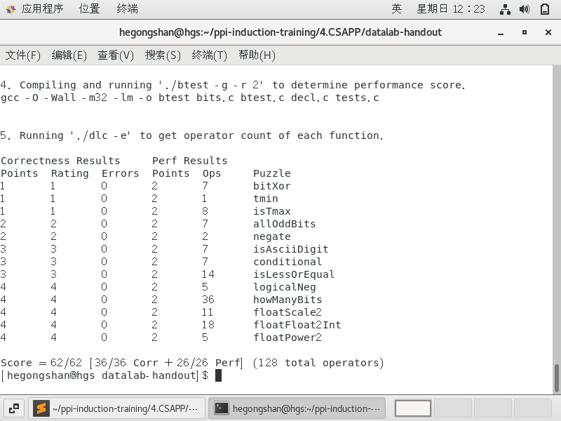
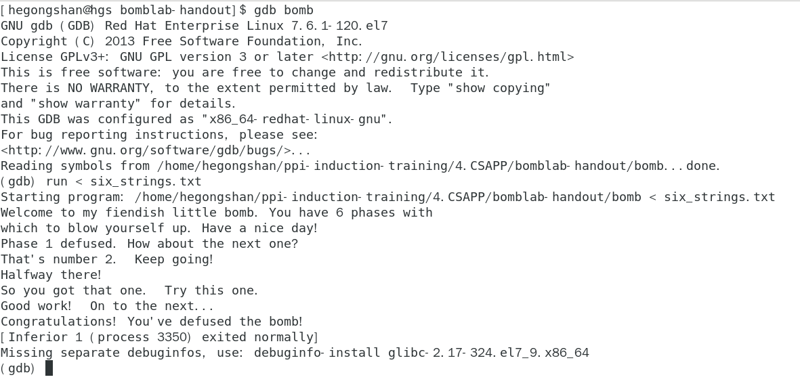
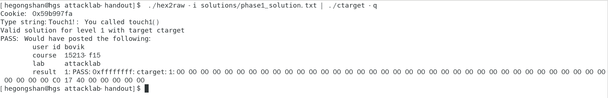
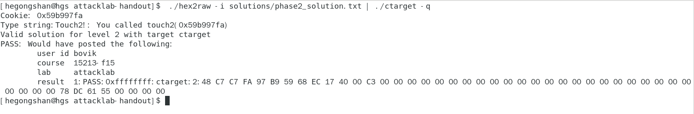
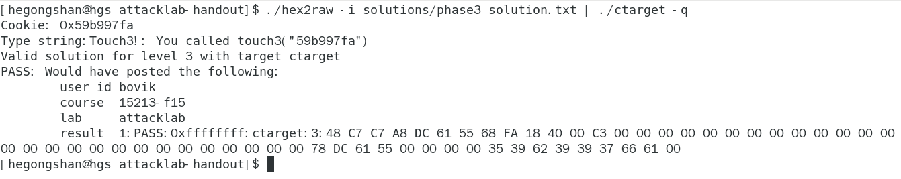
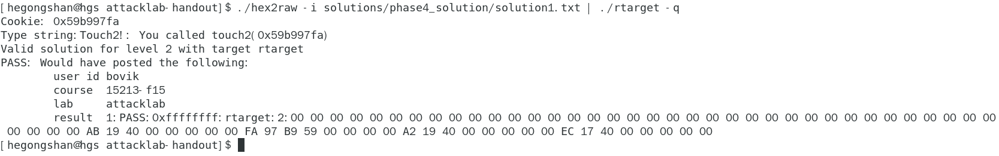
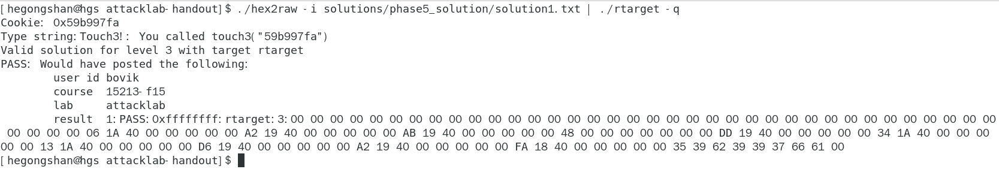
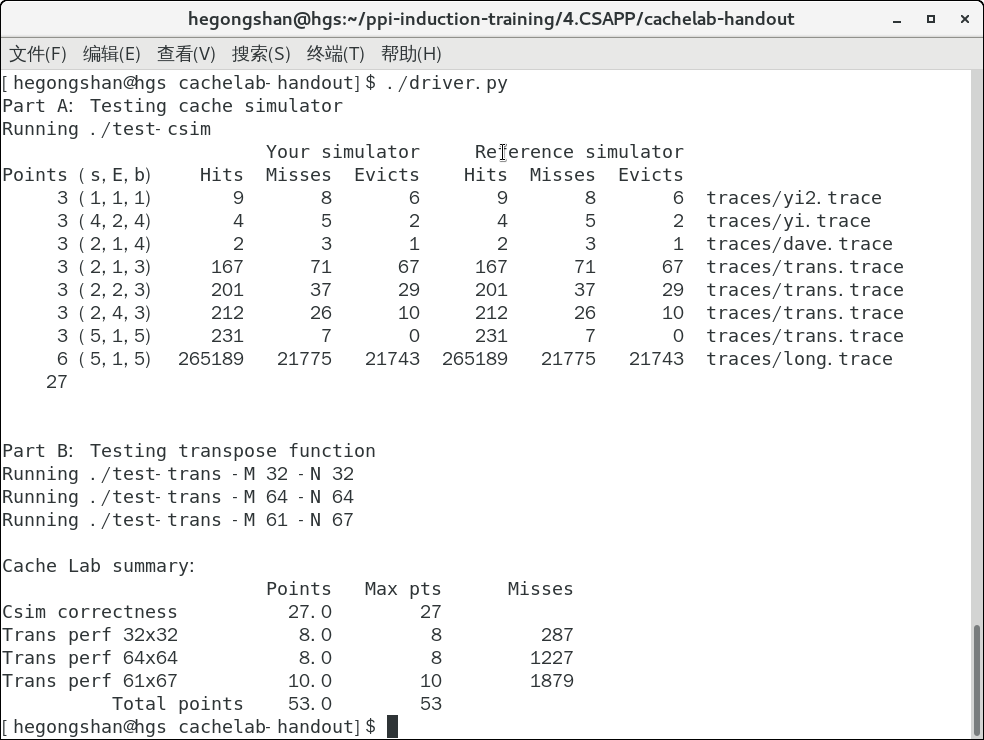

### CSAPP 实验

#### 1.Data Lab

[实验源码](./datalab-handout/bits.c)



#### 2.Bomb Lab

[实验原文件](./bomblab-handout/six_strings.txt)



#### 3.Attack Lab

* phase1

[实验原文件](./attacklab-handout/solutions/phase1_solution.txt)



* phase2

[实验原文件](./attacklab-handout/solutions/phase2_solution.txt)



* phase3

[实验原文件](./attacklab-handout/solutions/phase3_solution.txt)



* phase4

[实验文件](./attacklab-handout/solutions/phase4_solution/solution1.txt)



* phase5

[实验文件](./attacklab-handout/solutions/phase5_solution/solution1.txt)



#### 4.Cache Lab

* Part A: Writing a Cache Simulator

[实验代码](./cachelab-handout/csim.c)

* Part B: Optimizing Matrix Transpose

[实验代码](./cachelab-handout/trans.c)



#### 5.Shell Lab

[实验代码](./shlab-handout/tsh.c)

* 为所有的trace文件生成输出tsh.out

```python3
python3 test.py 
```

* 比较tshref.out和tsh.out

#### 6.Malloc Lab

[实验代码](./malloclab-handout/mm.c)


