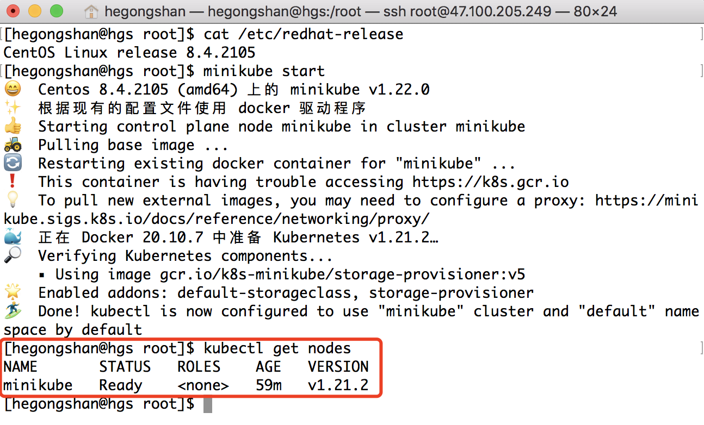

### Kubernetes

#### k8s安装使用

官方文档：[https://minikube.sigs.k8s.io/docs/start/](https://minikube.sigs.k8s.io/docs/start/)

* 安装minikube

```shell
curl -LO https://storage.googleapis.com/minikube/releases/latest/minikube-linux-amd64
sudo install minikube-linux-amd64 /usr/local/bin/minikube
```

* 启动minikube

以非root身份运行如下命令：

```shell
minikube start
```

* 安装kubectl

```shell
curl -LO https://storage.googleapis.com/kubernetes-release/release/\
$(curl -s https://storage.googleapis.com/kubernetes-release/release/stable.txt)\
/bin/linux/amd64/kubectl \ 
&& chmod +x kubectl \
&& sudo mv kubectl /usr/local/bin/
```

使用kubectl列出集群节点：

```shell
kubectl get nodes
```

效果如下：



